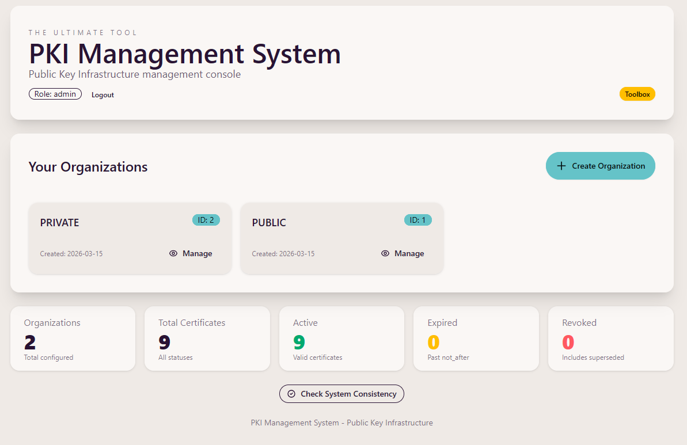

> This project is production ready.
> It is intended for production deployments with the hardening and operational guidance documented in this repository.
> Review the deployment, security, backup, and environment configuration sections before rollout.

# PKI Management System

<p align="center">
  
</p>

Web-based PKI management for root, intermediate, and end-entity certificates (server, client, email, OCSP responder) with policy enforcement, RBAC, CRL generation, audit logging, and multi-organization isolation.

## Overview

This application provides a complete, self-hosted certificate authority (CA) management platform for organizations managing their own PKI infrastructure. It enables teams to create, issue, renew, and revoke X.509 certificates across multiple organizations with role-based access control, encrypted storage, and cryptographic audit trails.

### Key Capabilities

- **Certificate Lifecycle Management** — Create root CAs, intermediate CAs, and end-entity certificates (TLS servers, client auth, S/MIME, OCSP responders) with configurable validity periods and cryptographic algorithms.
- **Multi-Organization Isolation** — Manage separate certificate hierarchies for different organizations in a single deployment with complete data isolation.
- **Role-Based Access Control** — Three roles (admin, manager, user) with granular permissions for creation, renewal, revocation, and downloads.
- **Certificate Revocation Lists** — Automatic CRL generation and distribution when certificates are revoked; public endpoints for external validators.
- **Encrypted Storage** — Certificate private keys and sensitive data encrypted at rest; decryption only on demand.
- **Audit Logging** — Track all certificate operations (creation, renewal, revocation, downloads) with user attribution, role, client IP address, and timestamps. The Recent Operations panel on the dashboard displays IP alongside each event.
- **Backup & Restore** — Export and restore full backups (database + certificate storage) from the Toolbox without server restart; atomic swaps ensure consistency; cross-platform restore supported (e.g., Windows → Linux) with matching encryption keys.
- **Policy-Driven Defaults** — Enforce certificate constraints (validity periods, key algorithms, SAN validation, and root password minimum length) via centralized policy configuration.

### Use Cases

- **Internal TLS Infrastructure** — Issue and manage TLS certificates for internal services, microservices, and APIs without external CA dependencies.
- **Client Certificate Authentication** — Deploy mTLS for secure service-to-service communication or employee device authentication.
- **Email & Document Signing** — Issue S/MIME certificates for encrypted email and digitally-signed document workflows.
- **IoT & Embedded Systems** — Manage device certificates for IoT deployments with automated renewal and revocation.
- **Development & Testing** — Create test certificates on-demand for development environments without managing external CA integrations.

## Quickstart with Docker Image

You can run the application directly from the published container image without building it locally.

For Docker deployment details, example Compose files, and container-specific setup, refer to [`/docker`](docker/README.md).

```bash
mkdir pki
cd pki
# copy docker/docker-compose.yml from this repository and adapt it if needed
nano docker-compose.yml

# create .env from this repository's .env.example and edit it
# or generate it from the project root with:
# python utils/generate_env.py --env dev --output pki/.env
# see utils/README.md for details

nano .env
docker compose up -d
```

The default Compose image is `ghcr.io/entr0-pi/pki-certificates:latest`. See [docker/README.md](docker/README.md) for Docker deployment details and [utils/README.md](utils/README.md) for `.env` generation.

## How-to for local dev

### Prerequisites

- Python 3.11+
- `uv`
- Node.js 18+ and `npm` for rebuilding frontend CSS

### 1. Install dependencies

```bash
uv venv
# activate the virtual environment
# PowerShell: .venv\Scripts\Activate.ps1
# bash/zsh: source .venv/bin/activate

uv pip install -r requirements.txt
npm install
```

If you also plan to run tests locally:

```bash
uv pip install -r tests/requirements-dev.txt
```

### 2. Configure environment

Create a local `.env` file. The application auto-loads it at startup.

Required secrets:

- `PKI_ENCRYPTION_KEY`
- `PKI_ENCRYPTION_SALT`
- `PKI_API_KEY_ADMIN`
- `PKI_API_KEY_MANAGER`
- `PKI_API_KEY_USER`
- `PKI_JWT_SECRET`

Commonly used settings:

| Variable | Default | Notes |
|----------|---------|-------|
| `PKI_HOST` | `0.0.0.0` | Bind address |
| `PKI_PORT` | `8000` | FastAPI port |
| `PKI_BASE_URL` | `http://localhost:8000` | Used in generated CRL distribution URLs |
| `PKI_DB_AUTO_REINIT` | `false` | Rebuild invalid DB from schema and keep a `*.invalid.bak` backup |
| `PKI_DATA_DIR` | `<repo>/data` | Must be an absolute path if set |
| `PKI_DB_PATH` | `<repo>/database/pki.db` | Must be an absolute path if set |
| `PKI_SESSION_MINUTES` | `60` | Session lifetime |
| `PKI_AUTH_COOKIE_NAME` | `pki_session` | Session cookie name |
| `PKI_COOKIE_SECURE` | `true` | Runtime default in code; must stay `true` behind HTTPS |
| `PKI_COOKIE_SAMESITE` | `lax` | Cookie SameSite policy |
| `PKI_COOKIE_DOMAIN` | empty | Optional cookie domain scope |

Example `.env`:

```dotenv
PKI_HOST=127.0.0.1
PKI_PORT=8000
PKI_BASE_URL=http://localhost:8000
PKI_DB_AUTO_REINIT=false

PKI_DATA_DIR=
PKI_DB_PATH=

PKI_ENCRYPTION_KEY=replace-with-a-strong-random-value
PKI_ENCRYPTION_SALT=replace-with-a-random-base64-salt

PKI_API_KEY_ADMIN=replace-with-admin-api-key
PKI_API_KEY_MANAGER=replace-with-manager-api-key
PKI_API_KEY_USER=replace-with-user-api-key
PKI_JWT_SECRET=replace-with-a-long-random-jwt-secret
PKI_SESSION_MINUTES=60

PKI_AUTH_COOKIE_NAME=pki_session
PKI_COOKIE_SECURE=false
PKI_COOKIE_SAMESITE=lax
PKI_COOKIE_DOMAIN=
```

Notes:

- Leave `PKI_DATA_DIR` and `PKI_DB_PATH` empty to use the repo defaults.
- If you set either path, it must be absolute.
- The application accepts your auth and cookie settings as provided; deployment hardening remains the operator's responsibility.
- Use a strong `PKI_JWT_SECRET` and keep it at 32+ random characters even though the current code only requires it to be non-empty.
- For local HTTP development, use `PKI_COOKIE_SECURE=false`; switch it to `true` for HTTPS deployments.
- Do not tighten cookie or CSP settings in production without validating the affected login, form, download, and frontend flows in your environment.
- Use `PKI_COOKIE_SECURE=true` in HTTPS deployments.

### 3. Initialize the database

```bash
python scripts/init_db.py
```

### 4. Build frontend assets

```bash
npm run build:css
```

This compiles `frontend/static/src/input.css` into `frontend/static/vendor/bundle.css`.

### 5. Run the application

```bash
python backend/app.py
```

Open `http://localhost:8000` and sign in with one of the configured API keys.

## Frontend build workflow

The frontend is server-rendered with Jinja templates and a compiled Tailwind CSS bundle.

- `npm install` installs Tailwind CSS and DaisyUI locally
- `npm run build:css` rebuilds the production CSS bundle
- `npm run watch:css` watches templates and regenerates CSS during UI work

If you only run the app and do not change templates or frontend dependencies, the committed CSS bundle is sufficient.

## Project structure

```text
backend/
  app.py                           FastAPI entrypoint and route handlers
  auth.py                          Session auth and RBAC helpers
  db.py                            Database access layer (schema v3)
  path_config.py                   Path resolution for data/db locations
  file_crypto.py                   AES-256-GCM encryption/decryption for all certificate artifacts
  cert_crypto.py                   Shared certificate utilities
  root_ca_create_crypto.py         Root CA generation
  intermediate_ca_create_crypto.py Intermediate CA generation
  end_entity_create_crypto.py      End-entity certificate generation (server, client, email, OCSP)
  revoke_cert_crypto.py            Revocation and CRL generation
  root_ca_validate.py              Certificate/CSR/key loading and signature verification helpers
  folder.py                        PKI directory layout management and workspace initialization
  helpers.py                       Shared utilities (dirs, permissions, password gen, OpenSSL wrappers)
  create_cert.py                   CLI entrypoint for certificate creation
  logging_config.py                Centralized ISO 8601 logging configuration
  uvicorn_log_config.py            Reference documentation for Uvicorn logging config structure
  config/
    policy.json                    Certificate policy, defaults, and root password length requirements
    rbac.json                      Route-to-role authorization map (single source of truth for all routes)
  openssl/
    config.txt                     OpenSSL config assets (for reference only, not used)
  schema/
    pki_schema.sql                 SQL schema

frontend/
  templates/                       Jinja HTML templates
  static/
    src/input.css                  Tailwind source file
    vendor/bundle.css              Built CSS served by FastAPI
    *.js                           Small UI behaviors

docs/
  *.md                             Operational, security, API, and frontend docs

tests/
  check_routes.py                  Route enforcement smoke test (RBAC verification on live app)
  conftest.py                      Pytest fixtures for in-process testing
  requirements-dev.txt             Test-only Python dependencies
  test_*.py                        Backend and UI workflow coverage

scripts/
  init_db.py                       Database initialization helper

utils/
  generate_env.py                  Creates `.env` from `.env.example` and generates secret values
  encryption_manager.py            CLI tool to decrypt or rotate encrypted PKI artifacts

.env.example                       Environment file (example)
package.json                       npm scripts for frontend asset builds
tailwind.config.js                 Tailwind/DaisyUI configuration
requirements.txt                   Python runtime dependencies
```

## Route Access Control

All HTTP route permissions are **centrally configured** in `backend/config/rbac.json` without requiring Python code changes:

```json
{
  "GET /auth/login": ["public"],           // Public endpoint (no auth required)
  "GET /toolbox": ["admin"],               // Admin only
  "GET /organizations": ["admin", "manager", "user"],  // Multiple roles allowed
  "GET /static/*": ["public"]              // Prefix pattern (wildcard)
}
```

**Key Features:**
- Use `["public"]` sentinel for unauthenticated routes
- List allowed roles to restrict access: `["admin"]`, `["admin", "manager"]`, etc.
- Routes without explicit role list allow any authenticated user
- Supports path parameters: `/organizations/{org_id}/...`
- Supports prefix patterns: `/static/*`, `/api/*`
- Comprehensive validation at startup ensures all routes are configured
- Invalid config fails application launch with clear error messages
- No Python code changes needed to adjust permissions

For details, see [docs/ROUTES.md - Access Control Configuration](docs/ROUTES.md#access-control-configuration-backendbconfigrbacjson).

## Technical Documentation

| Document | Purpose |
|----------|---------|
| [docs/ROUTES.md](docs/ROUTES.md) | HTTP routes, auth requirements, and RBAC matrix |
| [docs/DB_SCHEMA.md](docs/DB_SCHEMA.md) | SQLite schema and table relationships |
| [docs/SECURITY.md](docs/SECURITY.md) | Deployment hardening, secret handling, and operational security notes |
| [docs/FRONTEND.md](docs/FRONTEND.md) | Tailwind/DaisyUI frontend build workflow and asset pipeline |
| [docs/CRON_JOBS.md](docs/CRON_JOBS.md) | Scheduling guidance for consistency checks and maintenance tasks |
| [docs/TEST_PLAN.md](docs/TEST_PLAN.md) | Test scope and verification strategy |
| [docs/DATA_TREE.md](docs/DATA_TREE.md) | Project skeleton/reference layout |

## Testing

### Unit and Integration Tests

```bash
pytest -v
```

Install optional test dependencies from `tests/requirements-dev.txt` if your environment does not already have them.

### Route Enforcement Smoke Test

Test RBAC enforcement on a live running app:

```bash
# Start the app
python backend/app.py

# In another terminal, test all routes
python tests/check_routes.py --base-url http://localhost:8000

# Run with verbose output (show all routes)
python tests/check_routes.py --base-url http://localhost:8000 --verbose

# Test specific routes
python tests/check_routes.py --base-url http://localhost:8000 --filter toolbox --verbose

# Test with specific fixture IDs
python tests/check_routes.py --base-url http://localhost:8000 --org-id 1 --cert-id 3 --issuer-name root-ca
```

The `check_routes.py` tool verifies that every route in `rbac.json` correctly enforces role-based access control by making real HTTP requests to the app with different authentication levels (unauthenticated, admin, manager, user). It tests all 32 routes across 4 identities (128 checks total). See [docs/TEST_PLAN.md](docs/TEST_PLAN.md) for details.

## Security

- Keep `.env`, API keys, JWT secrets, and encryption material out of version control.
- Use HTTPS in production and set `PKI_COOKIE_SECURE=true`.
- Back up both the database and encrypted certificate storage regularly using the **Backup and Restore** features in the Toolbox (admin only). You can download backups and restore them at any time without requiring a server restart. Alternatively, manually archive the `database/` and `data/` directories.
- Review [docs/SECURITY.md](docs/SECURITY.md) before deploying outside local development.

Last update: 2026-03-22 — All routes centralized in `rbac.json` with startup validation for public and private routes; `["public"]` sentinel for unauthenticated endpoints; middleware configuration-driven with zero hardcoded exemptions; operators adjust access via config without code changes
